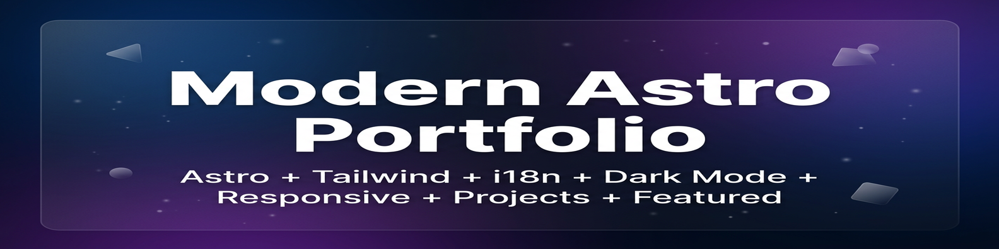
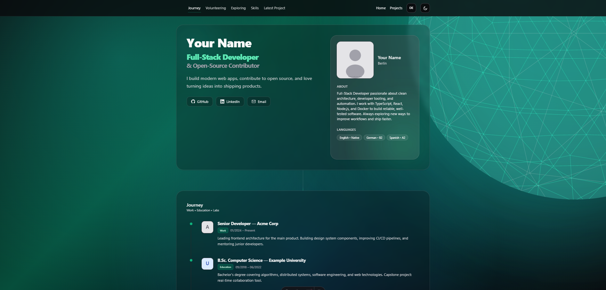
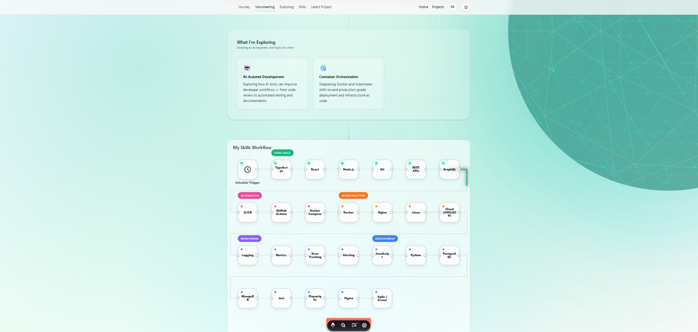

<div align="center">



Fork it. Customize it. Ship it.

[](https://mjsy.org/)
[](https://github.com/Mohammedaljer/astro-portfolio-template)

<br />

[](https://astro.build)
[](https://tailwindcss.com)
[](https://typescriptlang.org)
[](LICENSE)




n8n Workflow Skills


</div>

---

## Why This Theme?

Most portfolio templates are either too simple or too opinionated. This one gives you a **complete, real-world architecture** you can own:

- **Write projects in Markdown** — no CMS, no database, just files
- **Bilingual out of the box** — EN/DE with one toggle (extensible to more)
- **Looks great immediately** — glassmorphism UI, 3D orb, smooth animations
- **SEO done right** — JSON-LD, OG meta, canonical URLs, hreflang — all automatic
- **Deploy anywhere** — static output works on GitHub Pages, Netlify, Vercel, Cloudflare

---

## Features

| | Feature | Details |
|:--|:--------|:--------|
| 🎨 | **Dark / Light Mode** | Persistent, zero-FOUC toggle |
| 🌍 | **i18n (EN/DE)** | Auto-detection, `hreflang`, locale routing |
| 📂 | **Content Collections** | Zod-validated TypeScript schemas |
| ⭐ | **Featured + Filtering** | Pin projects & filter by category |
| 🖼️ | **Per-Project Media** | Logo, cover image, gallery per project |
| ♿ | **Accessibility** | ARIA, skip-link, `focus-visible` |
| 🔍 | **SEO** | JSON-LD, OG meta, canonical, sitemap-ready |
| 📱 | **Mobile-First** | Responsive at every breakpoint |
| ⚡ | **Skills Workflow** | Interactive n8n-style visualization |
| 🔮 | **3D Orb Hero** | Three.js animated background |
| 👍 | **Like Button** | Cloudflare Functions API (optional) |
| 🎯 | **Shiki Syntax Highlighting** | Code blocks with light/dark themes |

---

## Quick Start

```bash
git clone https://github.com/username/astro-portfolio-theme.git
cd astro-portfolio-theme
npm install
npm run dev          # → http://localhost:4321
```

> Requires **Node.js 18+**

| Command | Action |
|:--------|:-------|
| `npm run dev` | Dev server with hot reload |
| `npm run build` | Production build → `dist/` |
| `npm run preview` | Preview production build |

---

## Make It Yours (5 minutes)

Everything personal lives in **one file**: `src/data/cv.js`

### Step 1 — Identity

```js
// src/data/cv.js
export const profile = {
  name: "Your Name",
  roleTop: "Your Role",
  roleMid: "& Your Specialty",
  links: {
    github:   "https://github.com/you",
    linkedin: "https://linkedin.com/in/you",
    email:    "mailto:you@example.com",
  },
  // tagline, about — both EN & DE
};
export const locationLabel = "Your City";
```

### Step 2 — Add a Project

```bash
cp src/content/projects/_template.md src/content/projects/my-project.md
```

Fill in the frontmatter:

```yaml
---
title: "My Project"
description: "What I built and why."
pid: 4
date: 2025-06-01
slug: "my-project"
ready: true
featured: true                    # ← pin to the top
category: "tooling"               # automation | tooling | open-source | integration | research | self-hosted | other
tags: ["React", "Docker"]
image: "/images/projects/my-project/logo.png"
links:
  - label: "GitHub"
    url: "https://github.com/you/repo"
---
```

### Step 3 — Add Images

```
public/images/projects/my-project/
├── logo.png            # 200×200 — icon/logo
├── cover.png           # 1400×900 — hero screenshot
└── screenshot-1.png    # gallery images
```

### Step 4 — Deploy

```bash
npm run build           # → dist/
```

Upload `dist/` to any static host. Done.

---

## Project Structure

```
src/
├── data/cv.js                 # ⬅ YOUR identity, skills, timeline
├── data/i18n.js               # UI translations (EN/DE)
├── content/projects/          # Markdown project files
│   ├── _template.md           # Copy this for new projects
│   └── *.md                   # Your projects
├── content.config.ts          # Content Collection schema (Zod)
├── pages/[...locale]/         # i18n-ready pages
│   ├── index.astro            # Home
│   └── projects/
│       ├── index.astro        # Project grid + category filter
│       └── [slug].astro       # Project detail
├── components/                # Astro components
├── layouts/BaseLayout.astro   # Head, nav, footer, SEO
├── styles/global.css          # Design tokens + Tailwind
└── assets/                    # Optimized images (Astro <Image>)
    ├── me.svg                 # Profile photo placeholder
    ├── skills/                # Skill icons (auto-matched)
    └── timeline/              # Company/school logos

public/images/projects/<slug>/ # Per-project media (logo, cover, gallery)
docs/                          # Extended documentation
functions/api/                 # Cloudflare Functions (optional)
```

---

## Customization Reference

<details>
<summary><strong>Skills</strong></summary>

Edit `skills` in `src/data/cv.js`:

```js
export const skills = {
  core:           ["TypeScript", "React", "Node.js"],
  automation:     ["CI/CD", "GitHub Actions"],
  infrastructure: ["Docker", "Linux", "Nginx"],
  monitoring:     ["Logging", "Alerting"],
  dev:            ["Python", "PostgreSQL", "Jest"],
};
```

Add icons to `src/assets/skills/` — filename = slugified skill name (`"REST APIs"` → `rest-apis.svg`). Icons are auto-discovered.

</details>

<details>
<summary><strong>Timeline & Experience</strong></summary>

```js
// src/data/cv.js
export const timeline = {
  en: [
    {
      kind: "Work",             // Work | Education | Internship
      title: "Role — Company",
      date: "01/2024 – Present",
      text: "What you did...",
      logo: "company.svg",      // → src/assets/timeline/
    },
  ],
  de: [ /* German translations */ ],
};
```

</details>

<details>
<summary><strong>Colors & Theme</strong></summary>

CSS variables in `src/styles/global.css`:

```css
:root {
  --a1: ...;           /* Accent 1 — gradients, orb */
  --a2: ...;           /* Accent 2 */
  --a3: ...;           /* Accent 3 */
  --glass: ...;        /* Glassmorphism bg */
  --glass-border: ...; /* Glassmorphism border */
}
```

The default palette uses emerald/teal. To rebrand, search `emerald` across components and swap to your Tailwind color.

</details>

<details>
<summary><strong>i18n — Adding Languages</strong></summary>

1. Add locale to `astro.config.mjs` → `i18n.locales`
2. Add translations in `src/data/i18n.js`
3. Add path in `getStaticPaths()` of each page
4. Add `<div class="lang-xx">` blocks in project Markdown

Current: English `/` (default) + German `/de/` with auto-detection.

</details>

<details>
<summary><strong>SEO & Meta</strong></summary>

| Setting | Where |
|:--------|:------|
| Site URL | `astro.config.mjs` → `site` |
| Page title/desc | `src/layouts/BaseLayout.astro` |
| OG image | `public/images/og.jpg` (1200×630) |
| Favicon | `public/favico.png` |
| JSON-LD | Auto-generated (Person + SoftwareSourceCode) |
| Canonical | Auto-generated from site + path |
| hreflang | Auto-generated for EN/DE |

</details>

<details>
<summary><strong>Image Fallbacks</strong></summary>

| Missing | Fallback |
|:--------|:---------|
| Project cover | Logo on gradient background |
| Project logo | `"NO_PREVIEW"` text |
| Skill icon | Skill name as text |
| Timeline logo | Entry without icon |
| Profile photo | Placeholder SVG avatar |

Optimization: Use `.webp`/`.avif` for photos, `.svg` for icons. Astro `<Image>` handles format conversion. Keep covers under 500KB ([squoosh.app](https://squoosh.app)).

</details>

---

## Deployment

| Platform | Setup |
|:---------|:------|
| **GitHub Pages** | `npm run build` → Settings → Pages → GitHub Actions |
| **Netlify** | Build: `npm run build` · Publish: `dist/` |
| **Vercel** | Framework: Astro (auto) · Output: `dist/` |
| **Cloudflare Pages** | Build: `npm run build` · Output: `dist/` · Like API via `functions/` |

---

## FAQ

<details>
<summary>Can I remove German?</summary>

Yes. Remove `/de/` from `getStaticPaths()` in each page, remove `de` from `astro.config.mjs`, and delete `<div class="lang-de">` blocks.
</details>

<details>
<summary>Can I add more categories?</summary>

Add the value to the enum in `src/content.config.ts` and a label in the `categoryLabels` object in `src/pages/[...locale]/projects/index.astro`.
</details>

<details>
<summary>How do I remove the Like button?</summary>

Delete `<LikeFooter />` from `src/layouts/BaseLayout.astro` and the `functions/` directory.
</details>

<details>
<summary>Can I use a simple skills grid?</summary>

Replace `<SkillsWorkflow>` with `<Skills>` in `src/pages/[...locale]/index.astro`.
</details>

<details>
<summary>Works without Cloudflare?</summary>

Yes. The Like button is the only Cloudflare-specific feature. Everything else is static.
</details>

---

## Contributing

Contributions are welcome.

<p align="center">

  <a href="https://github.com/Mohammedaljer/astro-portfolio-template/fork">
    
  </a>
  <a href="https://github.com/Mohammedaljer/astro-portfolio-template/issues/new/choose">
    
  </a>
  <a href="https://github.com/Mohammedaljer/astro-portfolio-template/pulls">
    
  </a>
  <a href="https://github.com/Mohammedaljer/astro-portfolio-template/stargazers">
    
  </a>
</p>


---
## License

[MIT](LICENSE) — free for personal and commercial use.

---

<div align="center">
  <a href="https://mjsy.org">
    
  </a>

Built with [Astro](https://astro.build)

</div>
